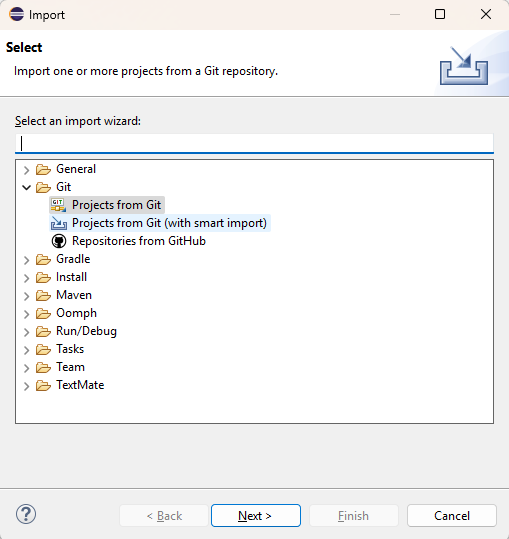
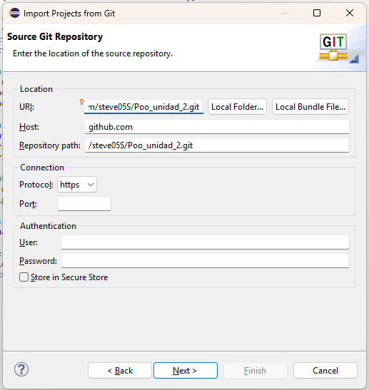
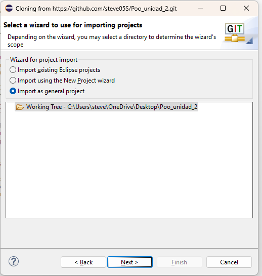
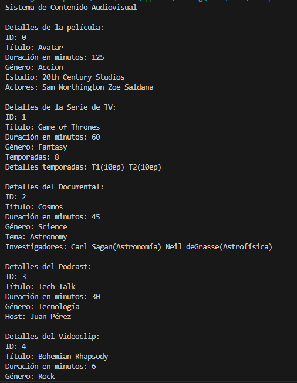

# Sistema de Contenido Audiovisual

## Descripción del Proyecto

Este proyecto es un sistema para gestionar diferentes tipos de contenido audiovisual como películas, series, documentales, podcasts y videoclips. Está desarrollado en Java usando conceptos de Programación Orientada a Objetos que hemos visto en clase.

### Propósito de la Aplicación

El sistema permite crear y mostrar información de distintos tipos de contenido audiovisual. Cada tipo tiene sus propias características específicas y puede relacionarse con otros elementos como actores, temporadas o investigadores.

### Características Principales

- **Películas**: Se pueden agregar actores
- **Series de TV**: Se pueden agregar temporadas con episodios
- **Documentales**: Incluyen investigadores especializados
- **Podcasts**: Tienen un host específico
- **Videoclips**: Están asociados con un artista musical

### Problema que Resuelve

Antes era difícil organizar información de diferentes tipos de contenido audiovisual en un solo lugar. Este sistema permite:
- Guardar información específica de cada tipo de contenido
- Mostrar detalles organizados de películas, series, documentales, etc.
- Demostrar cómo funcionan las relaciones entre clases en Java

## Estructura del Proyecto

El proyecto contiene los siguientes archivos:

**Directorio src/poo:**
- PruebaAudioVisual.java es *"el archivo principal para ejecutar"*

**Directorio src/uni2a:**
- ContenidoAudiovisual.java (clase base)
- Pelicula.java (clase para películas)
- SerieDeTV.java (clase para series de TV)
- Documental.java (clase para documentales) 
- Podcast.java (clase para podcasts)
- Videoclip.java (clase para videoclips)
- Actor.java (clase para actores)
- Temporada.java (clase para temporadas)
- Investigador.java (clase para investigadores)

## Instrucciones de Instalación y Uso

### Requisitos

- Java instalado en tu computadora
- Eclipse o cualquier IDE de Java
- Git para clonar el repositorio

### Paso 1: Clonar el Repositorio

```bash
git clone [https://github.com/steve05S/Poo_unidad_2.git]
```

### Paso 2: Abrir en Eclipse

1. Abre Eclipse
2. Ve a File → Import
3. Selecciona Git → Pro-ects from Git → Clone URI → Coloca el URl




4. Selecionar Impott as general project



5. Selecionar "Finish"


### Paso 3: Ejecutar el Programa

1. En Eclipse, navega hasta src/poo/PruebaAudioVisual.java
2. Click derecho sobre el archivo
3. Selecciona "Run" 

### Ejemplo de Uso

Cuando ejecutes el programa verás algo así:


